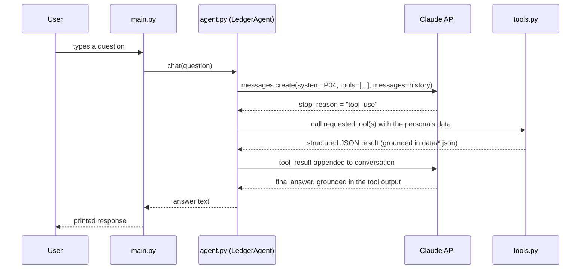

# Ledger AI — Architecture

*This document explains how Ledger AI is built and why, including deliberate design
tradeoffs and known limitations. It's written for anyone extending the project —
including future me, and anyone reviewing this as a portfolio piece.*

---

## Overview

Ledger AI is a Python CLI that lets an Australian SME owner ask plain-English
questions about their finances. It's built around four pieces:

- **Mock data** (`data/*.json`) — Xero-style financial data for three SME personas
- **Tools** (`src/tools.py`) — functions that query that data (transactions, invoices,
  GST, payroll, balances, expenses)
- **Agent** (`src/agent.py`) — the Claude API conversation loop, using tool use to
  ground every answer in real data rather than generated figures
- **Eval suite** (`evals/`) — 50 structured test cases plus an automated LLM-judge
  runner, used to catch regressions and validate behaviour systematically rather
  than by manual spot-checking alone

For the full history of prompt design decisions — every prompt written, every bug
found, and the reasoning behind every fix — see `PROMPTS.md`. That document is
the detailed engineering log; this one is the architectural summary.

---

## Data flow

A few things worth calling out about this loop:

- **Every factual answer is required to pass through a tool call.** The system
  prompt (P04) explicitly forbids answering from memory — this is what makes
  "grounded" more than a marketing word here. It's independently verifiable: you
  can check the actual dollar figures Claude states against `data/*.json`
  directly, which is exactly how most of the bugs documented in `PROMPTS.md`
  were caught.
- **The loop can run multiple tool calls per turn** (up to a safety cap of 12
  iterations) — a single question like "compare all four clients" genuinely
  needs several tool calls (one per client, or one broad call plus follow-ups),
  and the agent loop supports that without any special-casing.
- **Conversation history persists within a session** but each new `LedgerAgent`
  instance starts fresh — this matters for the eval runner specifically, which
  deliberately creates a new agent per test case so one case's answer can never
  leak into another's (see the Eval Methodology section below for why this
  mattered in practice, not just in theory).

---

## Tool design

`src/tools.py` exposes six tools to Claude:

| Tool | Purpose |
|------|---------|
| `get_transactions` | Filter transactions by date range, category, type, or free-text keyword |
| `get_account_balance` | Monthly opening/closing balances |
| `get_invoices` | Invoices filtered by status, with payable/receivable direction |
| `get_gst_summary` | GST collected/paid/net for a BAS quarter |
| `get_payroll_summary` | Payroll totals for a period |
| `get_expense_breakdown` | Expenses grouped by category |

A few design decisions worth explaining, since none of them were obvious at the
start — each one came from a real failure surfaced during testing (see
`PROMPTS.md` for the specific entry behind each):

**A normalisation layer handles genuine schema differences between personas.**
The three mock datasets don't share identical field names — café invoices use
`supplier`/`total`, electrician and freelancer use `client_name`/`amount_inc_gst`.
Every tool normalises these into one consistent shape before returning to Claude,
so the agent loop and system prompt never need persona-specific logic.

**Invoices carry an explicit `direction` field.** Café invoices are supplier
bills the business *owes* (accounts payable); electrician/freelancer invoices
are bills issued *to* clients (accounts receivable) — opposite directions of
money flow, using the same underlying data shape. Without an explicit direction
field, both the model and (it turned out) the eval suite itself independently
assumed the wrong direction for café specifically. Making it explicit rather
than inferred removed an entire category of "who owes whom" errors. (P25)

**`get_transactions` distinguishes cash received from income invoiced.** An
income-type transaction can represent an invoice being *issued* (accrual) or
actually *paid* (cash-basis) — these are genuinely different numbers whenever
an invoice is still outstanding at the end of a period. The tool returns both
`total_amount` (accrual) and `total_amount_cash_received`, with the outstanding
items explicitly flagged, so "how much did I bring in" defaults to the more
useful cash-basis answer without losing the accrual view entirely. (P14)

**`get_transactions` supports free-text keyword search, not just category
filtering.** Users describe things in their own words ("coffee shop working
sessions"), which often doesn't match the internal category taxonomy
("Client Entertainment") by name. This was a genuine capability gap, not a
prompt-wording issue — no amount of system prompt tuning can make a function
search a field it was never given the code to search. (P34)

---

## Eval methodology

Manual testing (Phase 2) validated that the system prompt's *designed*
behaviours worked in a simulated conversation. It didn't validate that the
*running application* — real tool calls against real data — produced the same
results, and in fact it didn't always: the very first live test surfaced a
revenue figure that didn't match the manually-tested version, because the
manual test had no real tool call behind it at all (P04's iteration notes).

The eval suite (`evals/test_cases.json`, 50 cases across all three personas
plus shared edge cases) exists to close that gap: every case runs a real
question through the real, live agent and grades the real answer.

**Why an LLM judge, not string matching.** The eval cases' `must_include`
criteria are a mix of literal values ("$24,602.40") and descriptive criteria
("GST breakdown") that a correct answer satisfies in spirit without ever
containing the literal phrase. A substring check would fail good answers
constantly. `src/eval_runner.py` instead uses a second Claude call as a judge,
instructed to assess each criterion's *intent* rather than its exact wording.

**The judge needed almost as much debugging as the app itself.** This turned
out to be a genuinely separate engineering problem, not a detail: across
several rounds (documented in `PROMPTS.md`, P12 through P24), the judge was
found to hallucinate false positives (flagging real, grounded figures as
"invented"), miscompute its own verification arithmetic, and — most
interestingly — occasionally write itemised, correct reasoning through every
individual criterion and then report an overall verdict that contradicted its
own reasoning. The fix for that last one was structural, not another wording
tweak: `eval_runner.py` now computes the pass/fail verdict itself, deterministically,
from the judge's itemised booleans, rather than trusting the judge's own
summary field. The lesson generalises: an LLM-as-judge system doesn't remove
the need for verification, it moves the verification problem one level up,
into the judge.

**Fixes aren't monotonic, and that's expected, not a failure.** Tightening the
model's behaviour in one direction consistently shifted which *other*,
previously-passing questions landed differently on the next run — this held
across essentially every batch of fixes made in Phase 3. After roughly ten full
suite runs, a small, consistent cluster of open-ended, interpretive questions
(a new-client characterisation, a home-office tax hedge, a vague time reference)
kept flipping between pass and fail with no rule changes in between some of the
flips. That's evidence of the practical ceiling of prompt-only engineering for
free-form generated answers, not unsolved bugs — a deterministic program either
has a bug or it doesn't; a system built on an LLM will produce a slightly
different answer to the same open-ended question run to run, the same way a
human support agent would. The project settled at a stable ~88% pass rate with
every remaining gap individually diagnosed and documented, rather than chasing
100% through further wording changes with diminishing returns. (P28, P31, P35)

**The eval suite itself needed debugging too.** Several test cases turned out
to expect figures that didn't actually exist in the mock data — a
cross-contamination between two similarly-named clients, a straightforward
arithmetic slip in a generated expected value, a materials list invented for a
transaction that only ever had a generic description. Each was only caught by
independently verifying against the raw dataset before assuming the *app* was
wrong — a recurring theme throughout this project, and the single habit most
responsible for the debugging actually converging rather than chasing phantom
bugs. (P21, P25, P26, P29, P32, P34, P36)

---

## Known limitations & production considerations

### Mock data can be internally inconsistent — and that's actually a useful lesson

During Phase 3 testing, the café dataset's pre-written monthly summaries
(`account_balances`) didn't reconcile with the sum of its individual line items
(`transactions`) — see `PROMPTS.md`, entry P11, for the full story. Depending on
which tool the model happened to call for a given question, it would return a
different (and sometimes wrong) figure for the same underlying question.

This was fixed by editing the mock data directly, since it's fiction with one job:
to be internally coherent for the demo and eval suite. **That fix is not available
in production.** A real Xero or MYOB feed is the customer's actual financial
reality — the app can never "correct" the data to make it prettier or more
convenient. Worth being explicit about, because real ledgers are often *messier*
than this mock one, not cleaner: pending vs. cleared transactions, timing lags
between an invoice being raised and a payment clearing, sync delays between the
accounting platform and the bank feed, and multi-currency rounding are all normal,
expected sources of numbers that don't perfectly reconcile.

**What this means for how the app should actually be designed:**

1. **Pick one authoritative source per concept, and don't silently blend paths.**
   A "what's my current balance" question should resolve through the same source
   every time — most likely the transaction ledger itself, since it's the more
   granular and harder-to-fake source — rather than whichever tool the model
   happens to reach for based on how the question was phrased.

2. **When two sources genuinely disagree, that should be surfaced to the user,
   not silently resolved by picking one.** This already happened once, unprompted,
   during testing: in the freelancer persona test (P09), Claude noticed an
   invoice appeared twice in a tool's result and told the user about the
   inconsistency rather than confidently reporting the inflated total. That's
   exactly the right instinct for an app that will eventually face real,
   imperfect production data.

3. **But that instinct isn't reliable yet, and it's worth understanding why.**
   The freelancer inconsistency was visible *within a single tool's output* — the
   same invoice number appearing twice in one result — so Claude could reason
   about it directly, in context, in one place. The café inconsistency only
   existed *across two different tools' outputs* (a pre-written summary tool vs.
   a tool that sums raw transactions) — nothing in the current system prompt or
   tool design prompts Claude to cross-check outputs from different tools against
   each other, so there was no way for it to notice.

4. **The concrete next step, if this were built for production:** add an explicit
   instruction — something like *"if a computed total differs meaningfully from a
   reported balance for the same period, say so explicitly rather than presenting
   either number as certain"* — so the behaviour that happened once by luck in
   the freelancer case becomes a deliberate, general guardrail rather than
   something that only surfaces when the inconsistency happens to be visible
   within a single tool call.

This is arguably a stronger answer to "how would this handle real, messy
production data" than a system that simply assumes clean data — because it
already surfaced a real inconsistency, once, correctly, and the fix is now
about generalising that instinct rather than inventing it from scratch.

---

### "Income" transactions conflate two different accounting events — resolved, see P14

> **Update:** this was fixed shortly after being identified — see `PROMPTS.md`,
> entry P14. `get_transactions` now distinguishes cash-received from accrued
> income directly. The rest of this section is kept as-is because the
> reasoning behind the fix is worth keeping, not because the limitation is
> still open.

While fixing a duplicate-transaction bug in the electrician dataset (`PROMPTS.md`,
entry P13), it became clear that a `"type": "income"` transaction entry is used
for two genuinely different events without distinguishing between them: an
invoice being *issued* (accrual — work done, not yet paid), and an invoice being
*paid* (cash actually received). Both get tagged identically.

This mostly doesn't matter, since duplicate entries for the same invoice have
been removed — but for an invoice that's *issued* within the reporting period
and *still outstanding* at the end of it (as happens with INV-2523 in June), the
single remaining transaction represents accrued, not received, income. A
question like "what did I bring in this month" is ambiguous as a result: summing
all `type: income` transactions answers "what was invoiced," not "what cash
actually landed" — and these are genuinely different numbers for any SME with
outstanding invoices at month end, which is a very normal, common situation.

**If this were built for production:** transactions would need an explicit
distinction — e.g. a `basis: "accrued"` vs `basis: "received"` field, or simply
treating `date_paid` as the authoritative signal for cash-basis questions and
`date_issued` for accrual-basis ones — so the app (and the person asking the
question) can be clear about which kind of "income" is being reported. Given
most SME owners think in cash-basis terms ("what actually came in"), that's
probably the right default, with accrual figures available as a secondary view
rather than the default interpretation.

---

### LLM output has an irreducible reliability ceiling that no amount of prompting removes

A small cluster of eval cases (`PROMPTS.md`, P35) kept flipping between pass
and fail across many runs with no correlated rule changes — all on open-ended,
interpretive questions rather than narrow factual lookups. Every one of these
received at least one, and in several cases two or three, rounds of targeted
prompt refinement, and none of them converged to a stable pass.

**What this means for production:** for any question where the "right answer"
depends on the model noticing, prioritising, and characterising something
correctly inside a long free-form response — rather than retrieving a single
fact — expect a non-zero failure rate that prompting alone won't close to
zero. Two structural mitigations would likely do more than further wording
changes:

1. **Move detection out of the prompt and into the tool layer wherever
   possible.** The clearest example: rather than relying on the model to
   notice and prioritise an invoice's `notes` field (a solicitor referral,
   say) inside a six-finding anomaly summary, `get_invoices` could return a
   dedicated `flagged_notes` list separately from the general results, so the
   information can't get lost in a long response even if the model's framing
   varies run to run.
2. **Report a rolling pass rate across multiple eval runs, not a single run's
   number.** A probabilistic system's true reliability is better represented
   by a distribution than a point estimate — running the suite three times and
   reporting the range is a more honest signal than any single 44/50.

---

## Deployment notes

- **Model choice is a real cost/quality tradeoff, not just a config value.**
  The project initially scaffolded on Opus with adaptive thinking; switching to
  Sonnet cut cost substantially with no measurable quality loss for this
  task, but the switch itself briefly changed *which* tool the agent reached
  for on a given question — a reminder that changing the underlying model can
  change behaviour, not just cost, even with an identical prompt (P11).
- **Prompt caching is enabled** on the system prompt and tool definitions
  (P27), since both are identical on every call within a session — a 90%
  discount on cache reads makes this a straightforward win for both the
  interactive CLI and the eval runner's batches of same-persona calls.
- **The eval judge uses a separate, lighter model call** than the agent under
  test, deliberately — grading a fixed set of criteria doesn't need the same
  reasoning budget as answering an open financial question, and keeping them
  separate means the judge's cost scales independently of any future change
  to the agent's model.
- **API keys are pay-as-you-go, not a flat subscription** — worth knowing
  before running large eval batches repeatedly during development; a single
  50-case run with a judge call per case is inexpensive per run, but adds up
  over the many iterative runs a debugging session like this one involved.